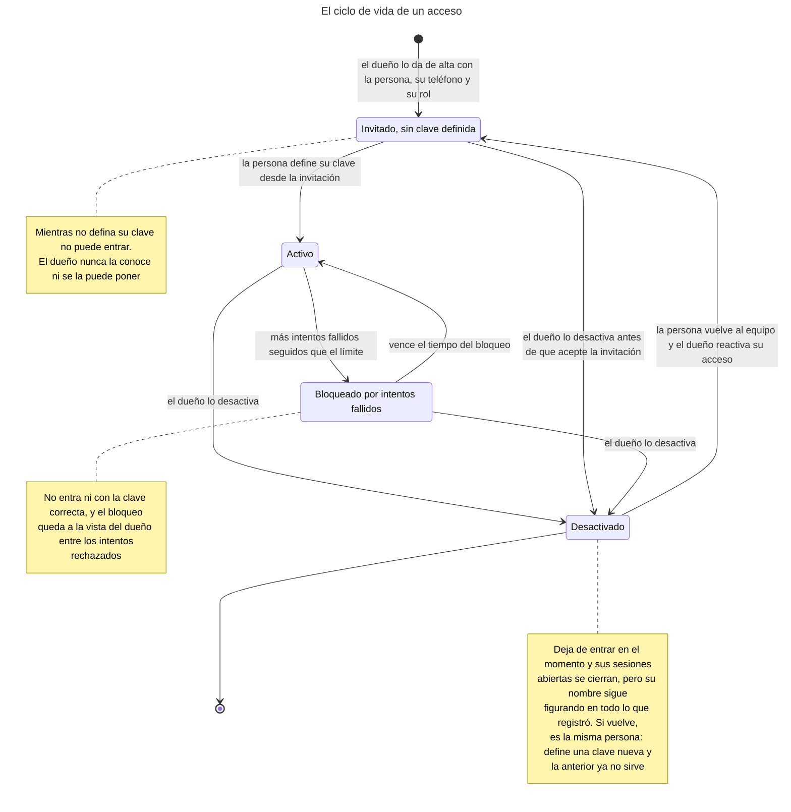
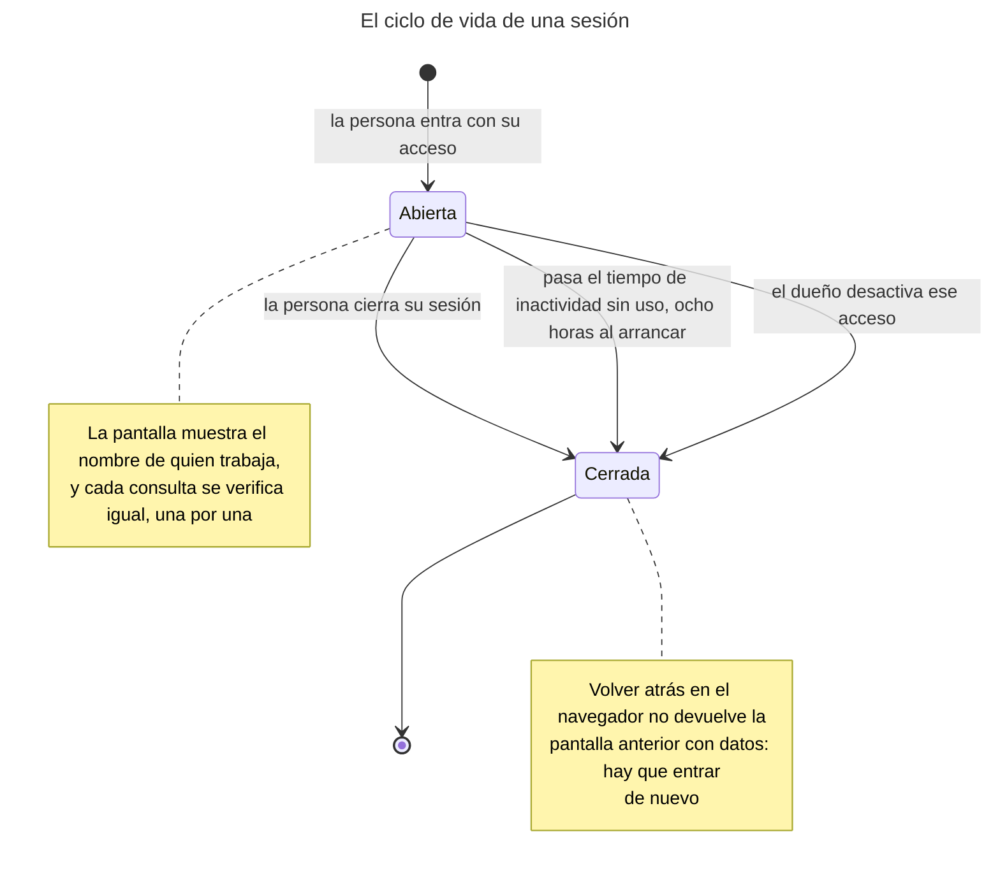
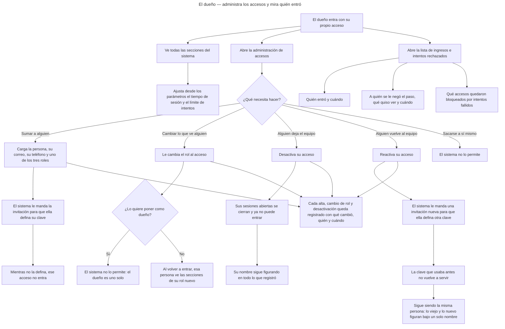
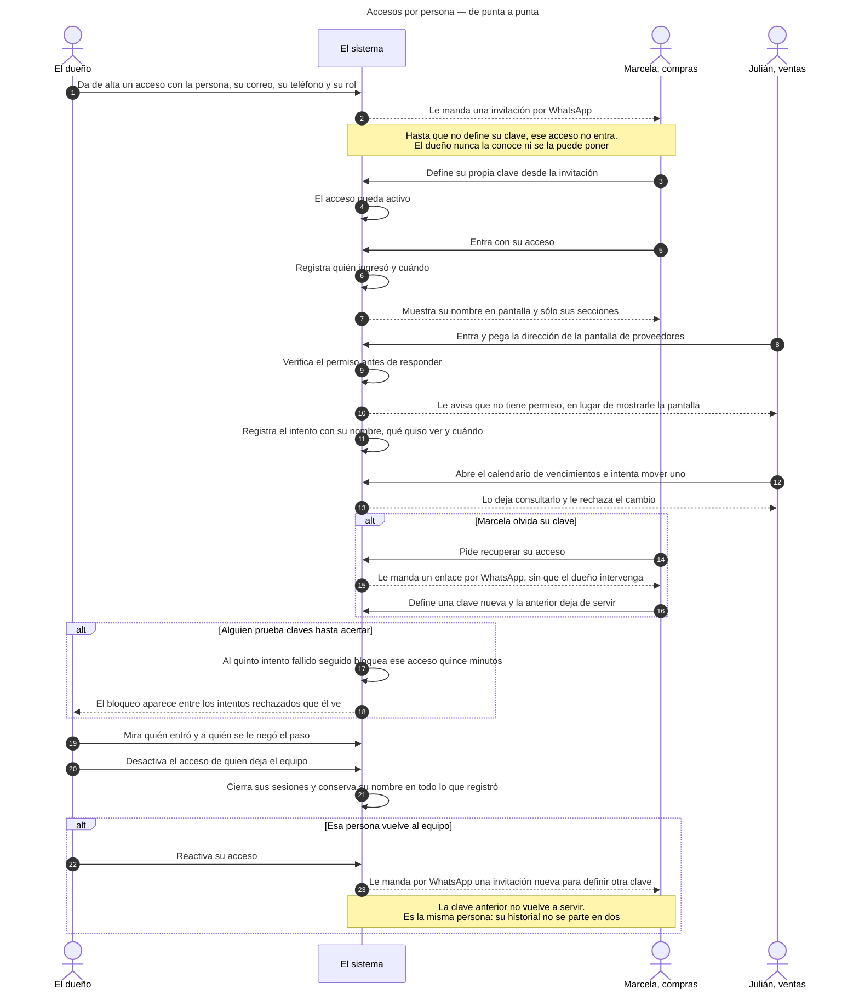
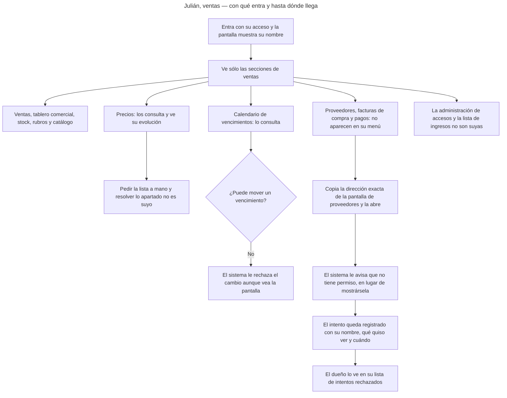
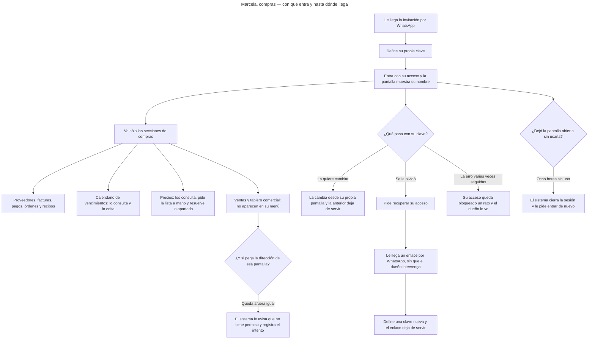
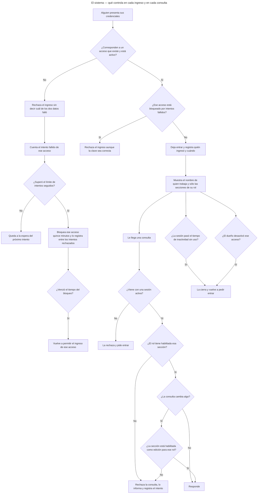

<!-- GENERADO por scripts/diagrams/export.sh — NO editar a mano.
     Fuente: los .mmd de esta carpeta. Regenerar: scripts/diagrams/export.sh -->

# Diagramas

> Vista renderizada de los diagramas de esta feature. Fuente: los `.mmd` de esta
> carpeta. Convención: `docs/specs/DIAGRAMS.md`. Las imágenes para el cliente se
> generan en `dist/diagramas/` con `make diagrams`.

## El ciclo de vida de un acceso

## El ciclo de vida de una sesión

## El dueño — administra los accesos y mira quién entró

## Accesos por persona — de punta a punta

## Julián, ventas — con qué entra y hasta dónde llega

## Marcela, compras — con qué entra y hasta dónde llega

## El sistema — qué controla en cada ingreso y en cada consulta

