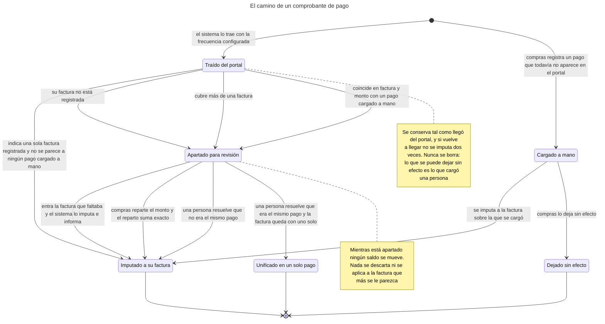
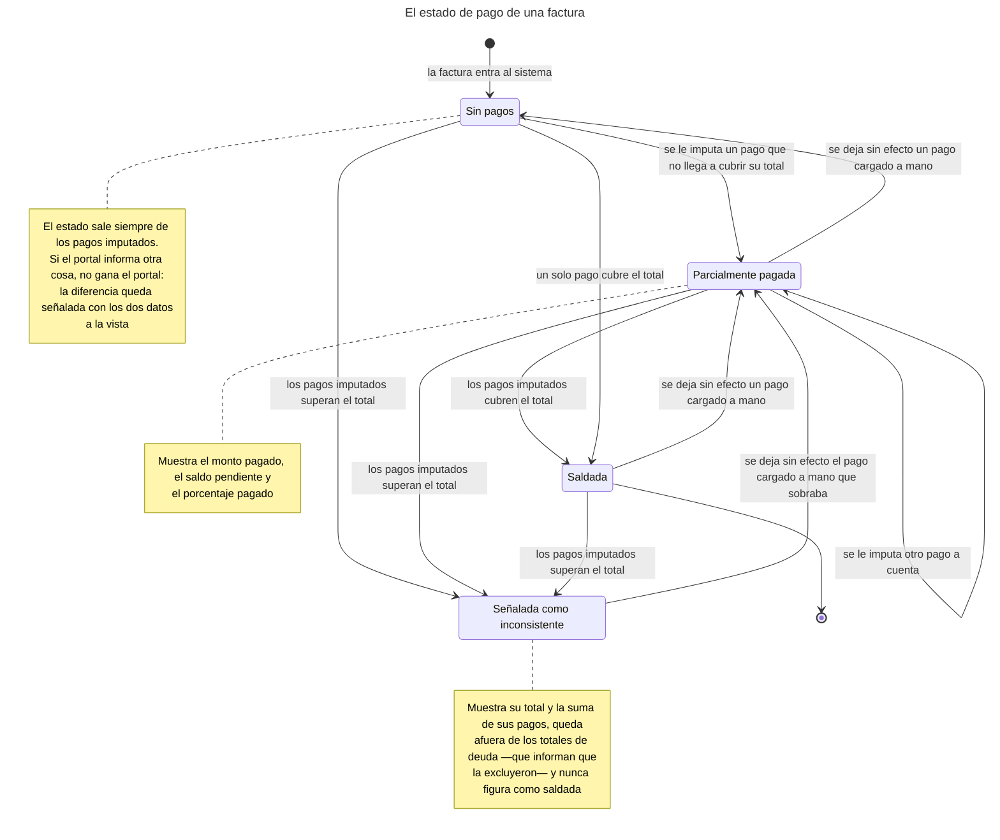
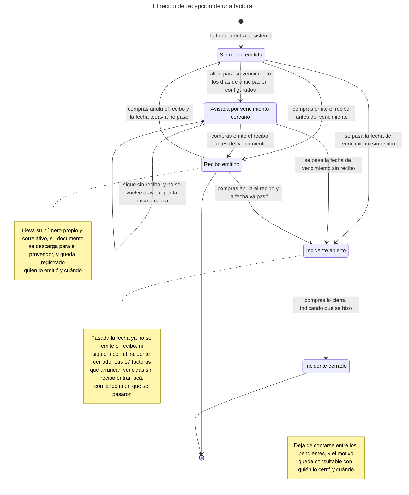
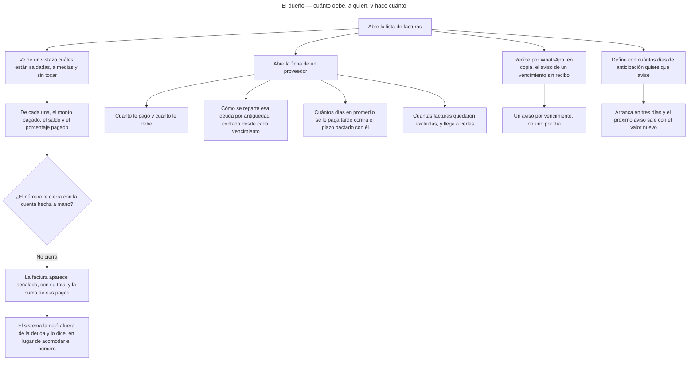
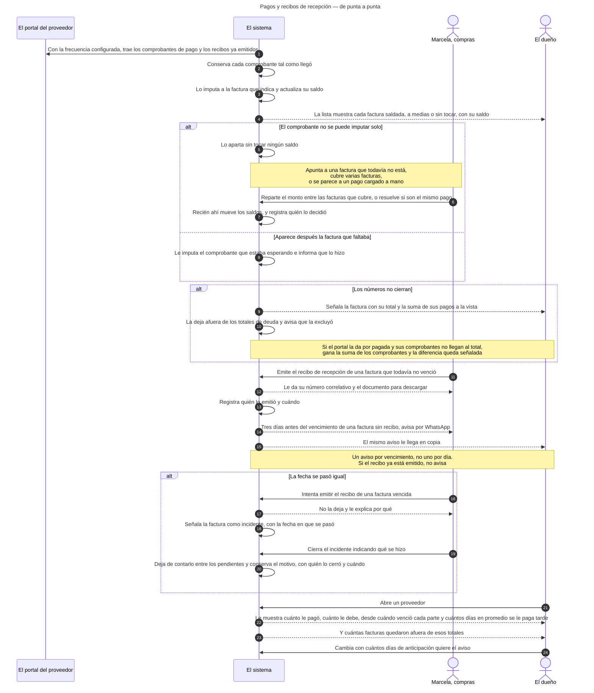
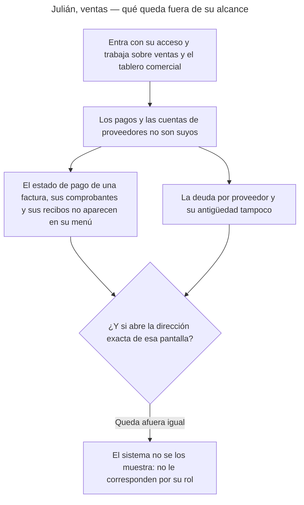
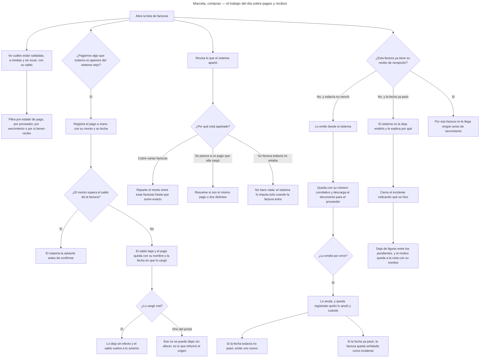
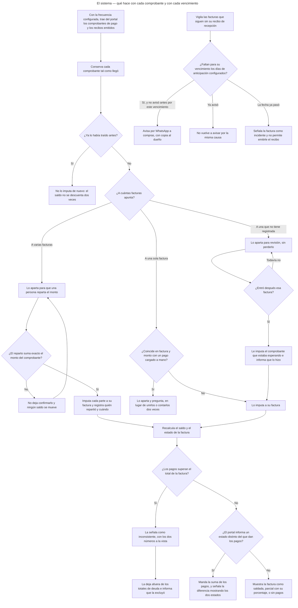

<!-- GENERADO por scripts/diagrams/export.sh — NO editar a mano.
     Fuente: los .mmd de esta carpeta. Regenerar: scripts/diagrams/export.sh -->

# Diagramas

> Vista renderizada de los diagramas de esta feature. Fuente: los `.mmd` de esta
> carpeta. Convención: `docs/specs/DIAGRAMS.md`. Las imágenes para el cliente se
> generan en `dist/diagramas/` con `make diagrams`.

## El camino de un comprobante de pago

## El estado de pago de una factura

## El recibo de recepción de una factura

## El dueño — cuánto debe, a quién, y hace cuánto

## Pagos y recibos de recepción — de punta a punta

## Julián, ventas — qué queda fuera de su alcance

## Marcela, compras — el trabajo del día sobre pagos y recibos

## El sistema — qué hace con cada comprobante y con cada vencimiento

