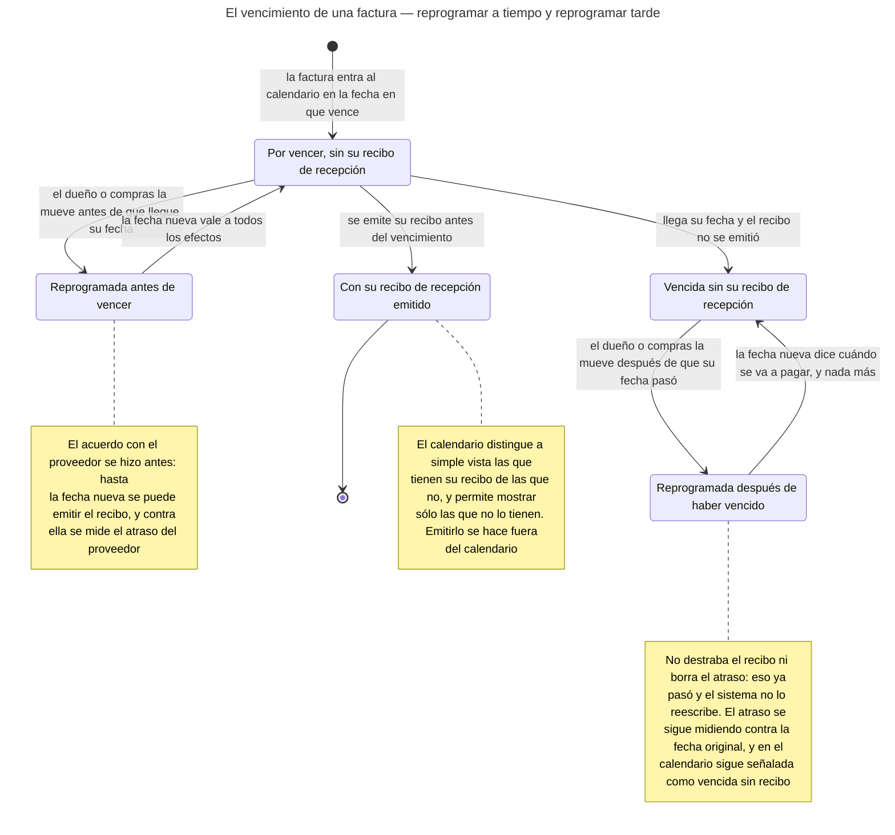
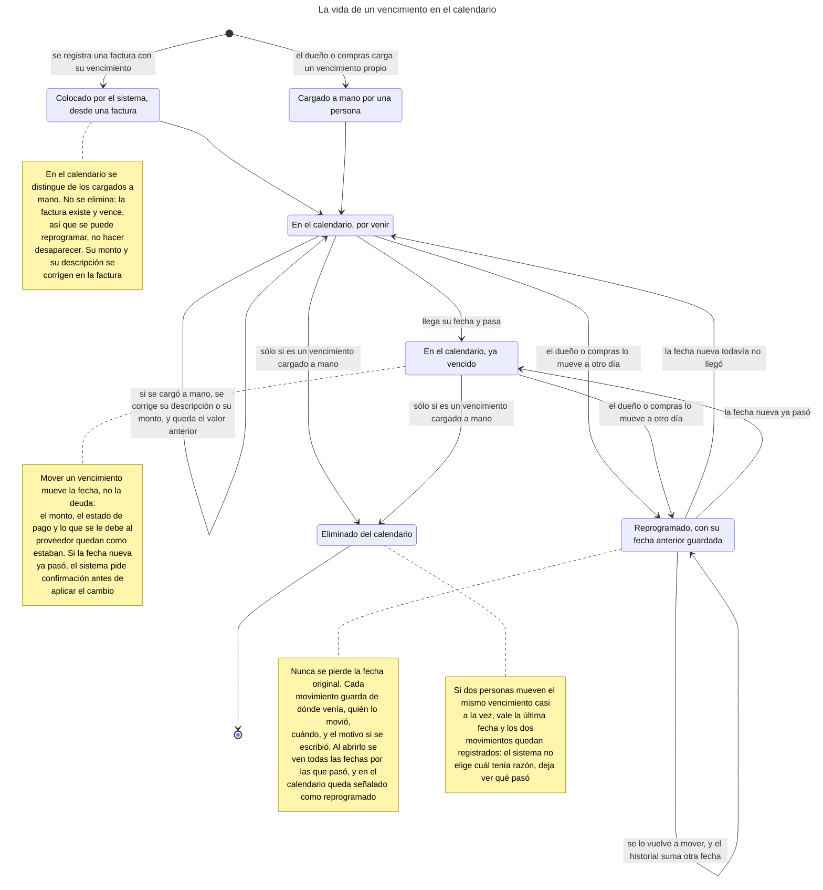
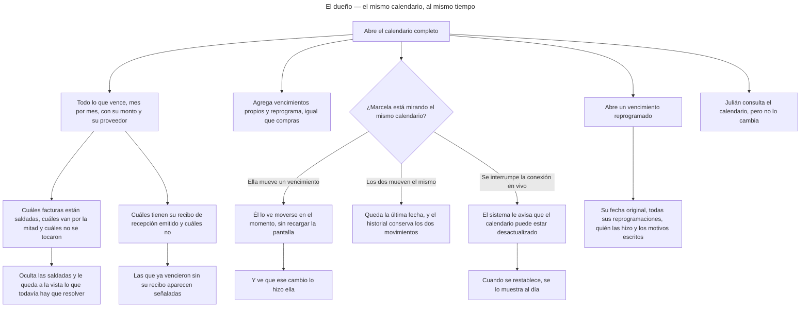
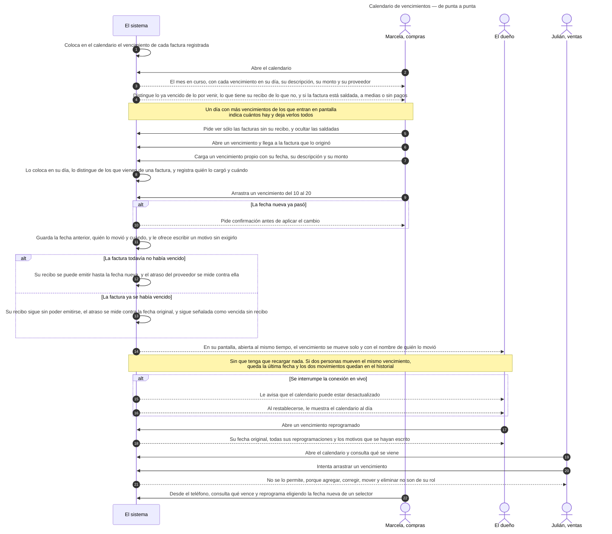
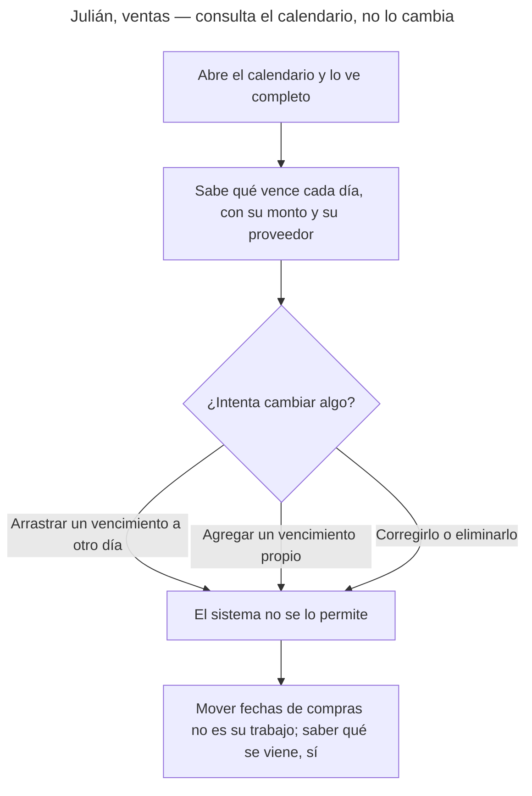
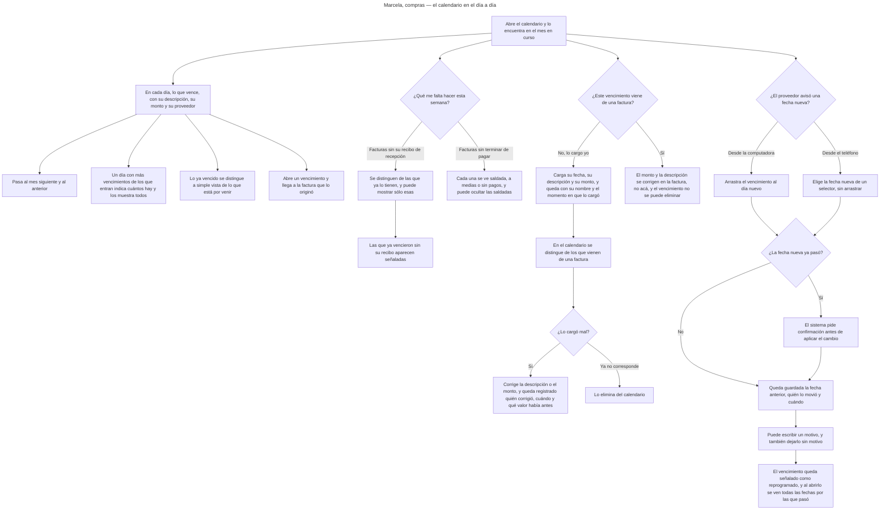
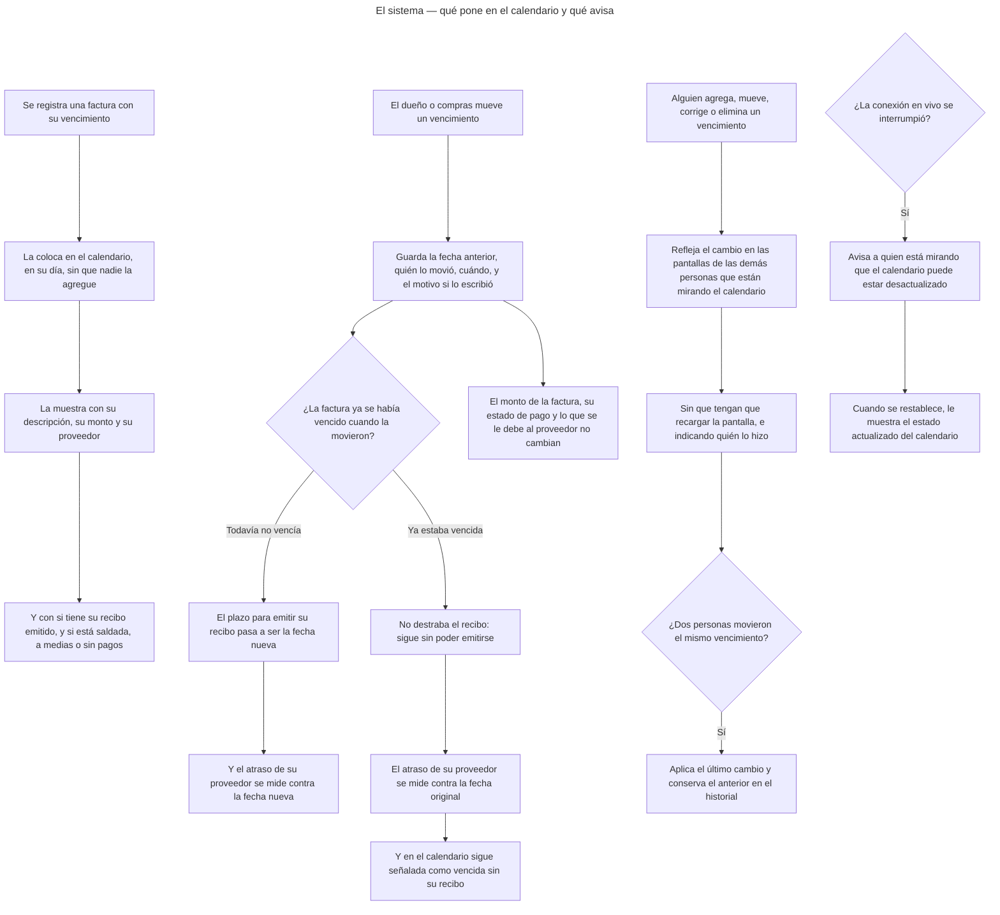

<!-- GENERADO por scripts/diagrams/export.sh — NO editar a mano.
     Fuente: los .mmd de esta carpeta. Regenerar: scripts/diagrams/export.sh -->

# Diagramas

> Vista renderizada de los diagramas de esta feature. Fuente: los `.mmd` de esta
> carpeta. Convención: `docs/specs/DIAGRAMS.md`. Las imágenes para el cliente se
> generan en `dist/diagramas/` con `make diagrams`.

## El vencimiento de una factura — reprogramar a tiempo y reprogramar tarde

## La vida de un vencimiento en el calendario

## El dueño — el mismo calendario, al mismo tiempo

## Calendario de vencimientos — de punta a punta

## Julián, ventas — consulta el calendario, no lo cambia

## Marcela, compras — el calendario en el día a día

## El sistema — qué pone en el calendario y qué avisa

