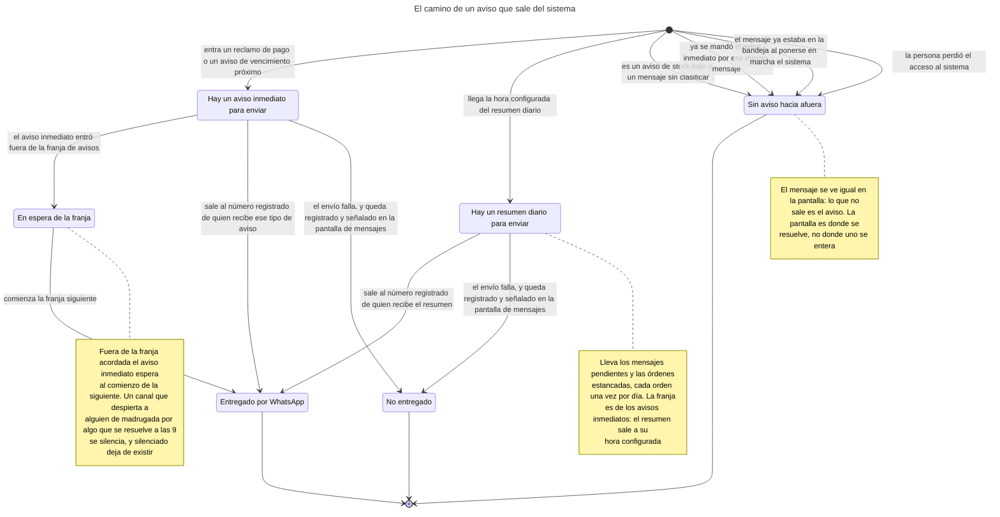
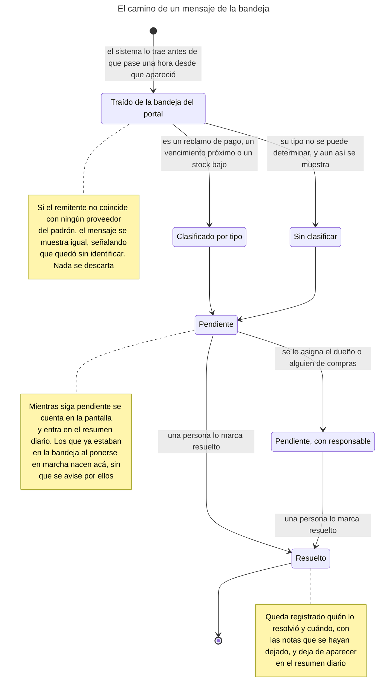
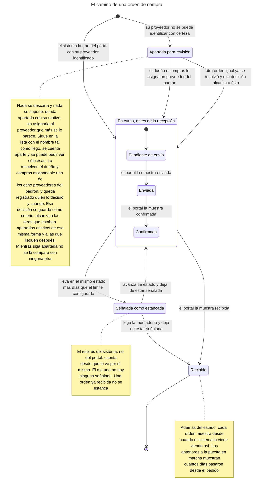
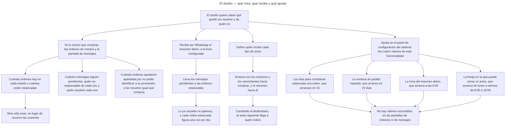
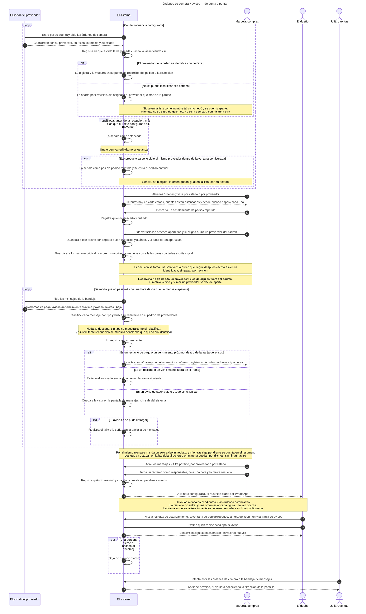
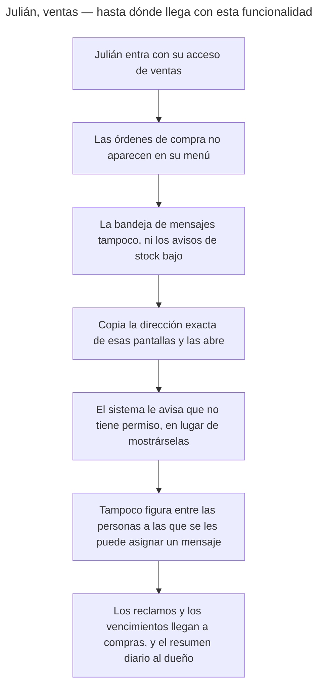
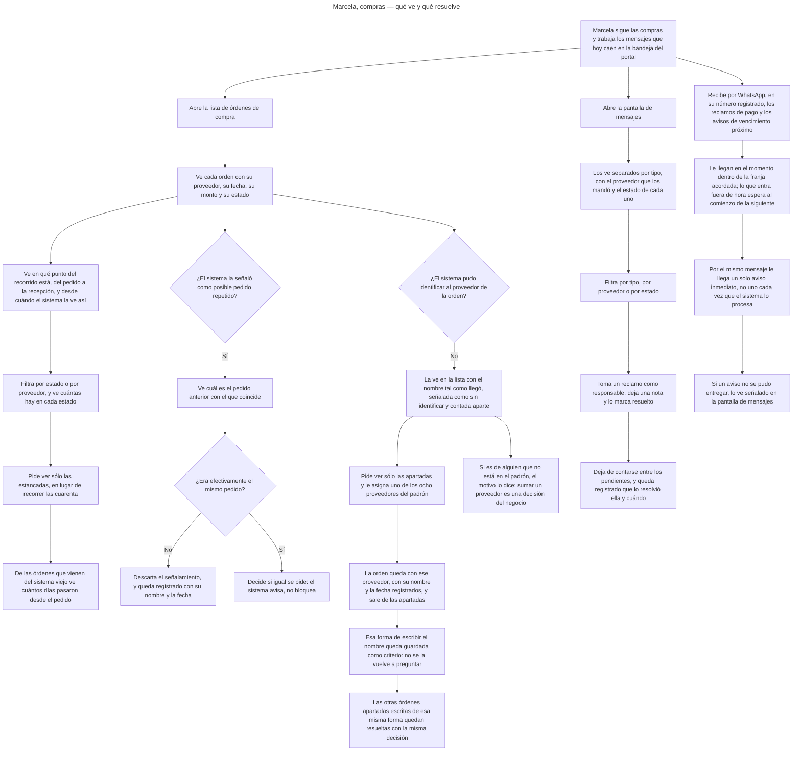
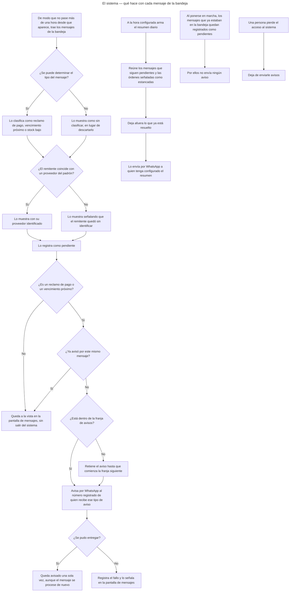
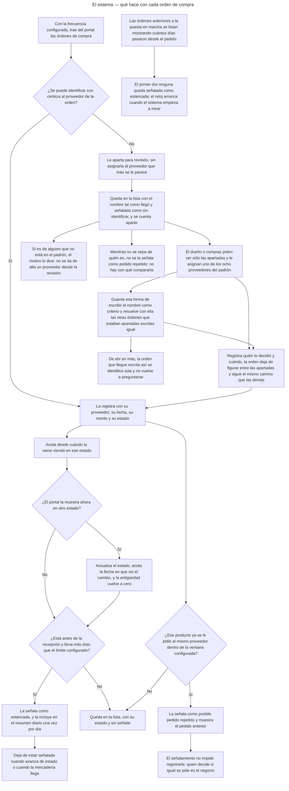

<!-- GENERADO por scripts/diagrams/export.sh — NO editar a mano.
     Fuente: los .mmd de esta carpeta. Regenerar: scripts/diagrams/export.sh -->

# Diagramas

> Vista renderizada de los diagramas de esta feature. Fuente: los `.mmd` de esta
> carpeta. Convención: `docs/specs/DIAGRAMS.md`. Las imágenes para el cliente se
> generan en `dist/diagramas/` con `make diagrams`.

## El camino de un aviso que sale del sistema

## El camino de un mensaje de la bandeja

## El camino de una orden de compra

## El dueño — qué mira, qué recibe y qué ajusta

## Órdenes de compra y avisos — de punta a punta

## Julián, ventas — hasta dónde llega con esta funcionalidad

## Marcela, compras — qué ve y qué resuelve

## El sistema — qué hace con cada mensaje de la bandeja

## El sistema — qué hace con cada orden de compra

