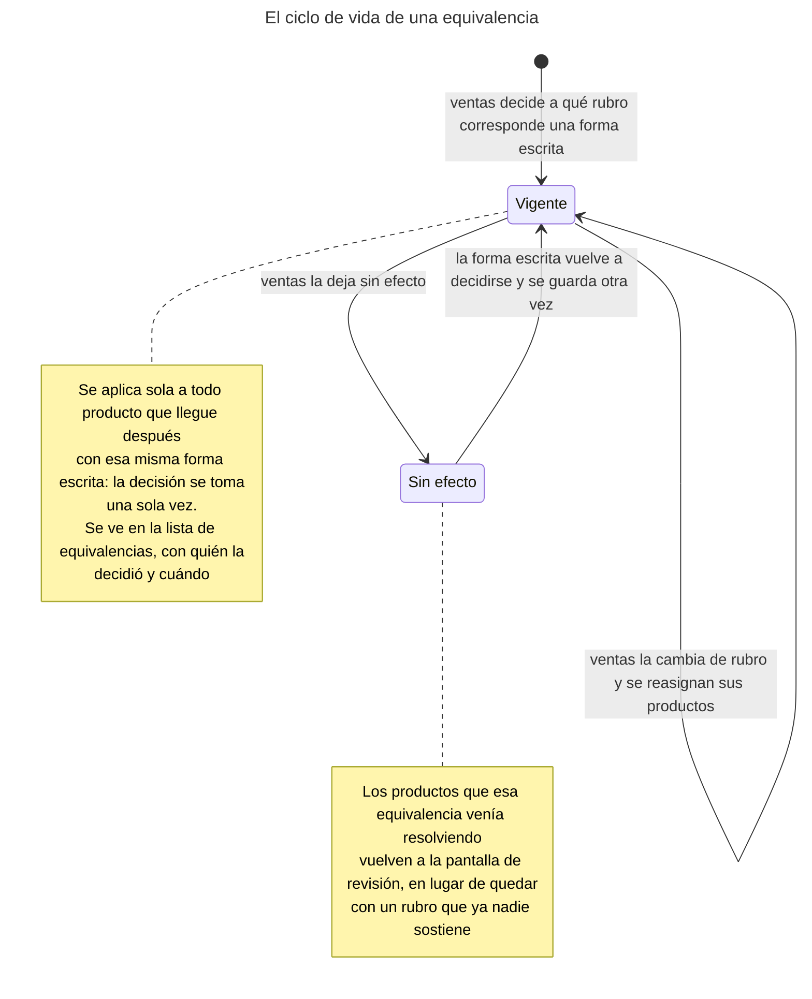
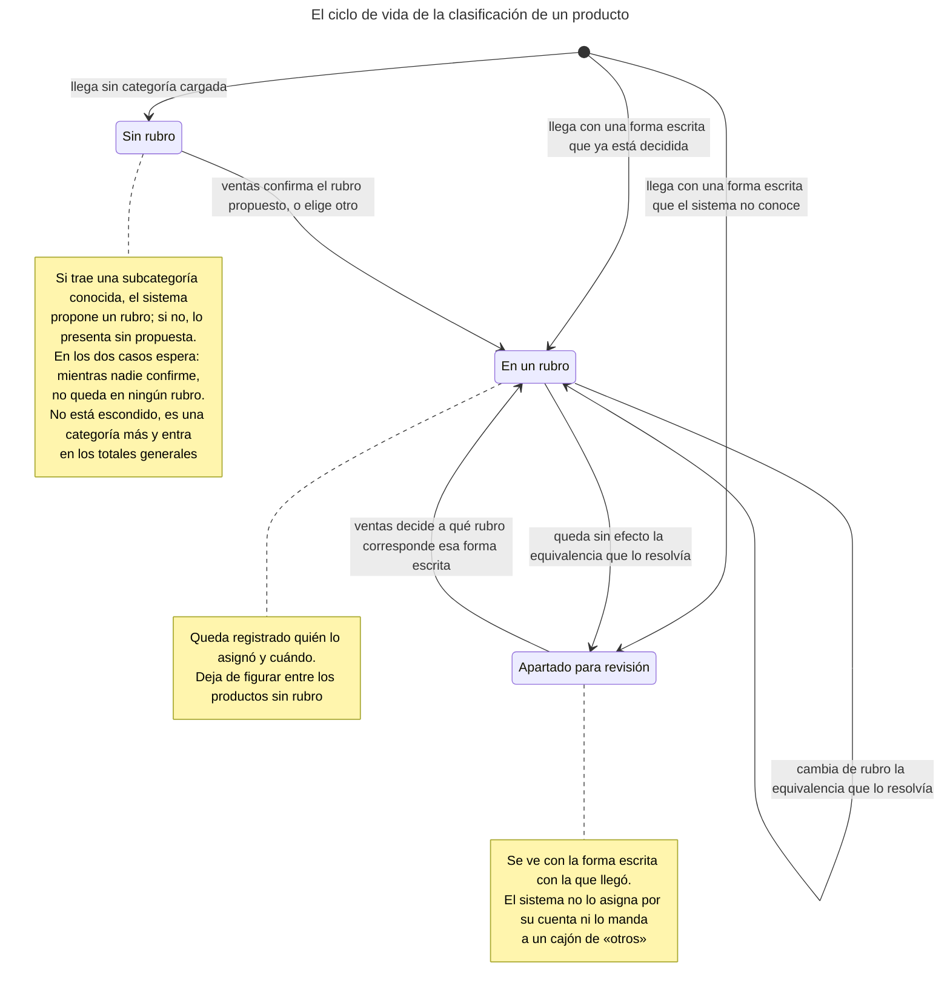
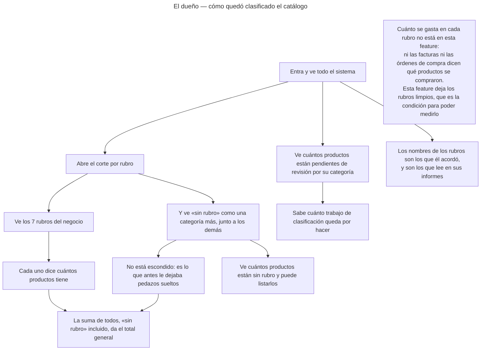
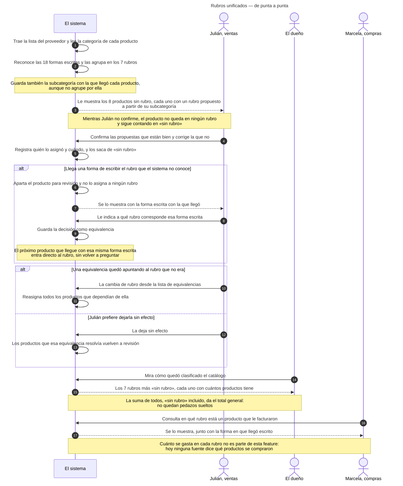
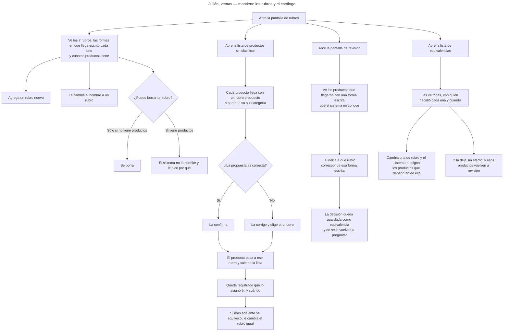
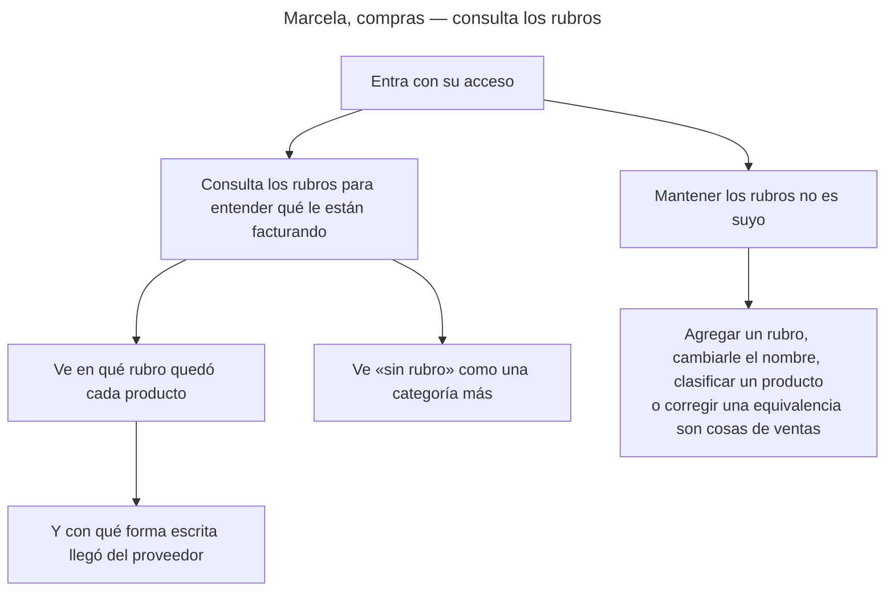
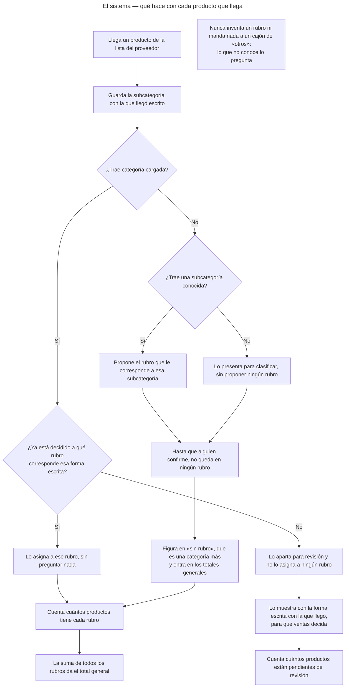

<!-- GENERADO por scripts/diagrams/export.sh — NO editar a mano.
     Fuente: los .mmd de esta carpeta. Regenerar: scripts/diagrams/export.sh -->

# Diagramas

> Vista renderizada de los diagramas de esta feature. Fuente: los `.mmd` de esta
> carpeta. Convención: `docs/specs/DIAGRAMS.md`. Las imágenes para el cliente se
> generan en `dist/diagramas/` con `make diagrams`.

## El ciclo de vida de una equivalencia

## El ciclo de vida de la clasificación de un producto

## El dueño — cómo quedó clasificado el catálogo

## Rubros unificados — de punta a punta

## Julián, ventas — mantiene los rubros y el catálogo

## Marcela, compras — consulta los rubros

## El sistema — qué hace con cada producto que llega

