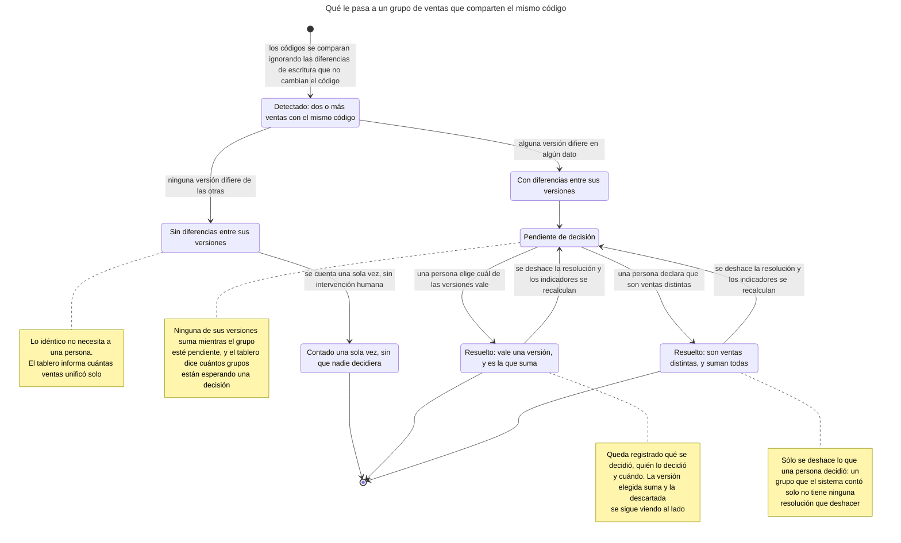
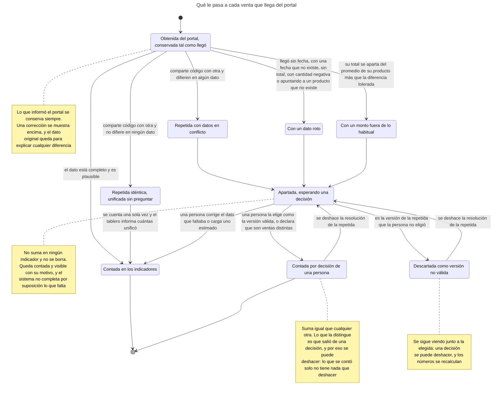
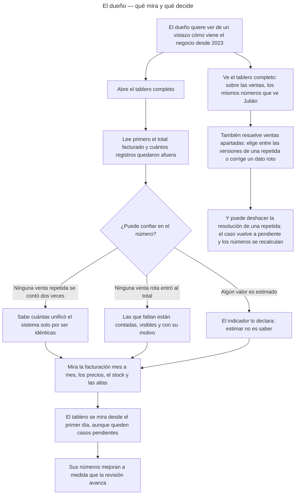
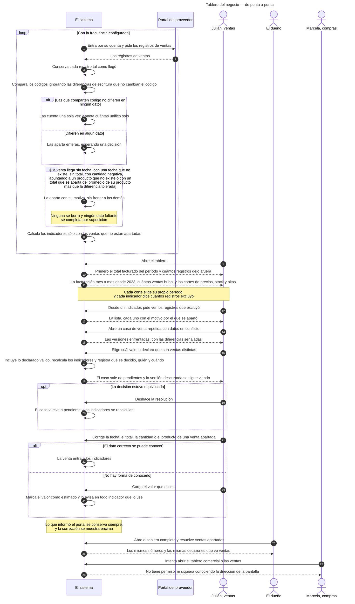
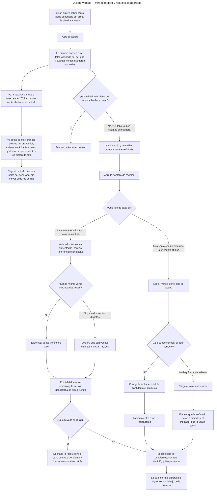
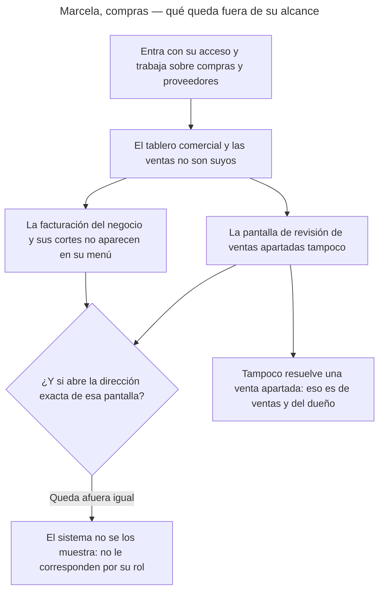
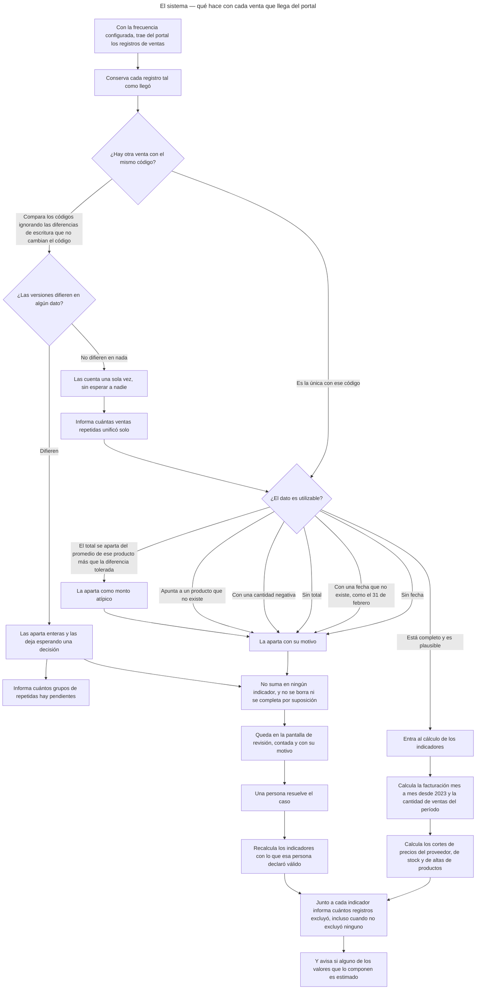

<!-- GENERADO por scripts/diagrams/export.sh — NO editar a mano.
     Fuente: los .mmd de esta carpeta. Regenerar: scripts/diagrams/export.sh -->

# Diagramas

> Vista renderizada de los diagramas de esta feature. Fuente: los `.mmd` de esta
> carpeta. Convención: `docs/specs/DIAGRAMS.md`. Las imágenes para el cliente se
> generan en `dist/diagramas/` con `make diagrams`.

## Qué le pasa a un grupo de ventas que comparten el mismo código

## Qué le pasa a cada venta que llega del portal

## El dueño — qué mira y qué decide

## Tablero del negocio — de punta a punta

## Julián, ventas — mira el tablero y resuelve lo apartado

## Marcela, compras — qué queda fuera de su alcance

## El sistema — qué hace con cada venta que llega del portal

