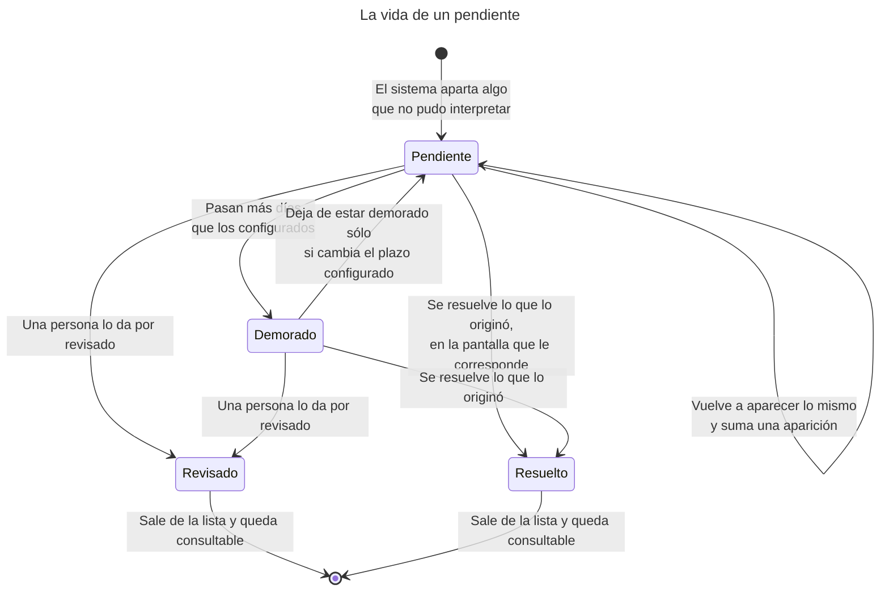
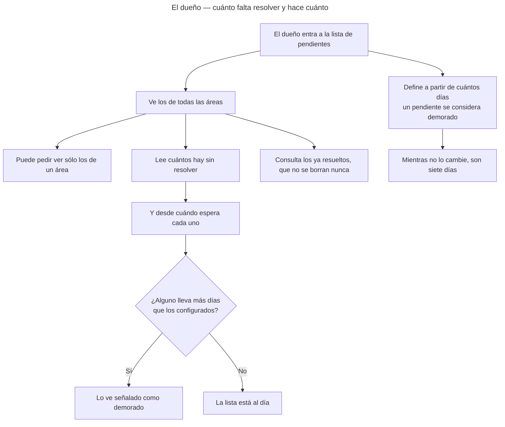
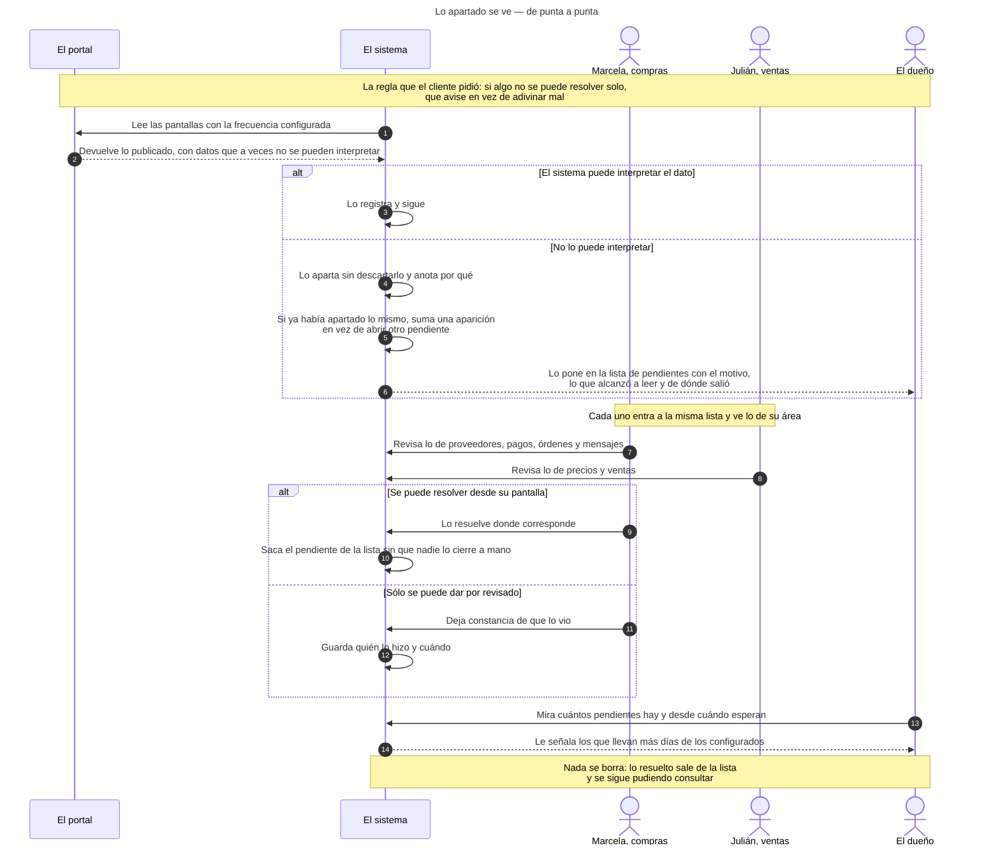
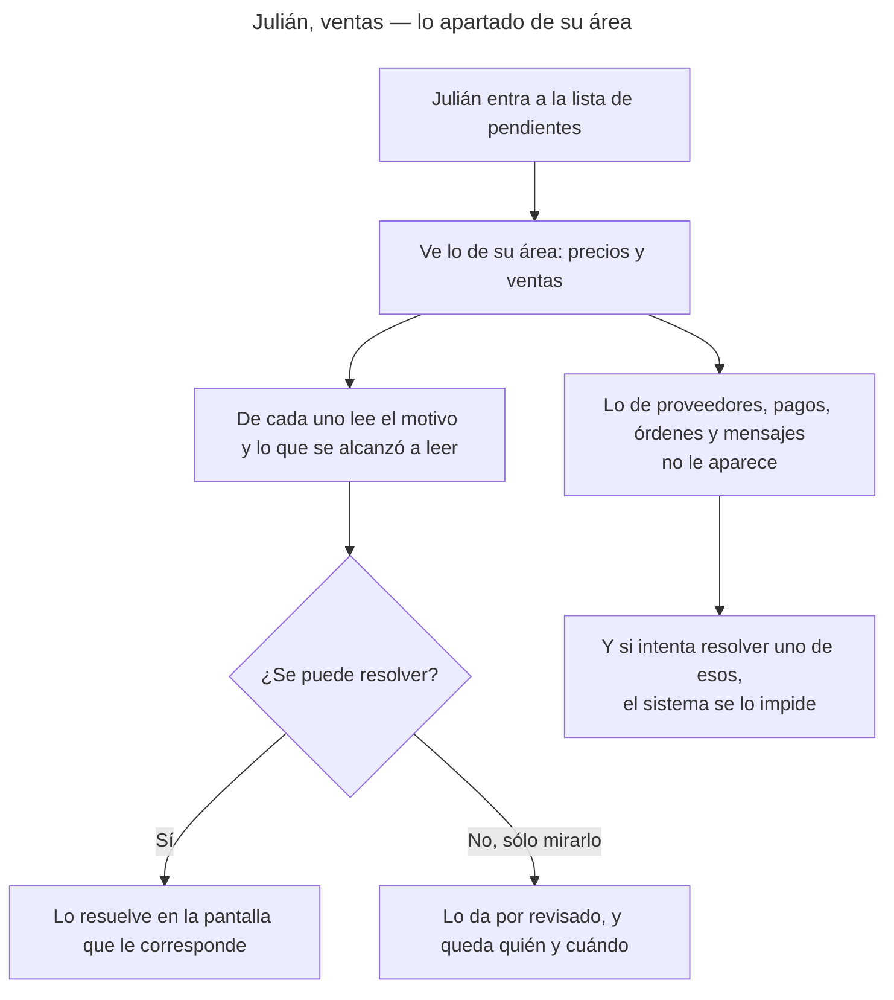
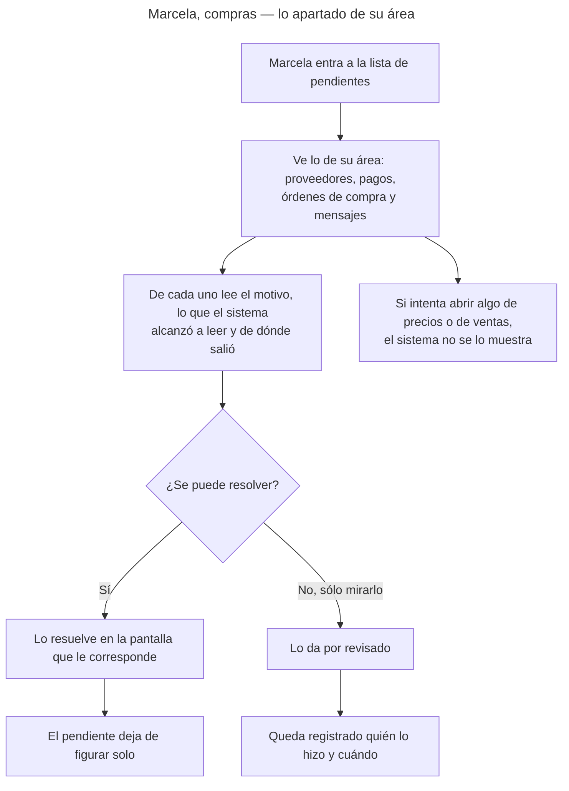
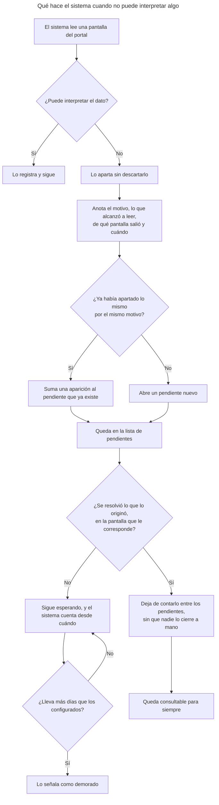

<!-- GENERADO por scripts/diagrams/export.sh — NO editar a mano.
     Fuente: los .mmd de esta carpeta. Regenerar: scripts/diagrams/export.sh -->

# Diagramas

> Vista renderizada de los diagramas de esta feature. Fuente: los `.mmd` de esta
> carpeta. Convención: `docs/specs/DIAGRAMS.md`. Las imágenes para el cliente se
> generan en `dist/diagramas/` con `make diagrams`.

## La vida de un pendiente

## El dueño — cuánto falta resolver y hace cuánto

## Lo apartado se ve — de punta a punta

## Julián, ventas — lo apartado de su área

## Marcela, compras — lo apartado de su área

## Qué hace el sistema cuando no puede interpretar algo

