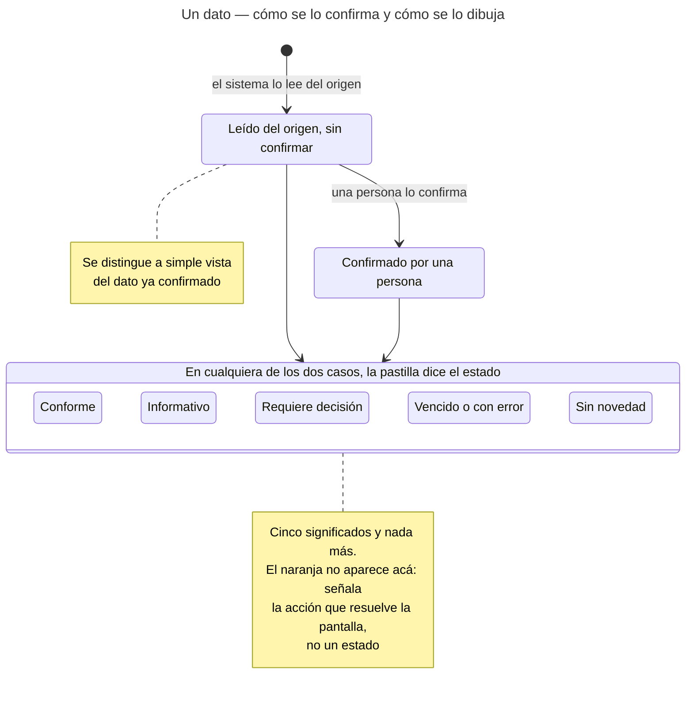
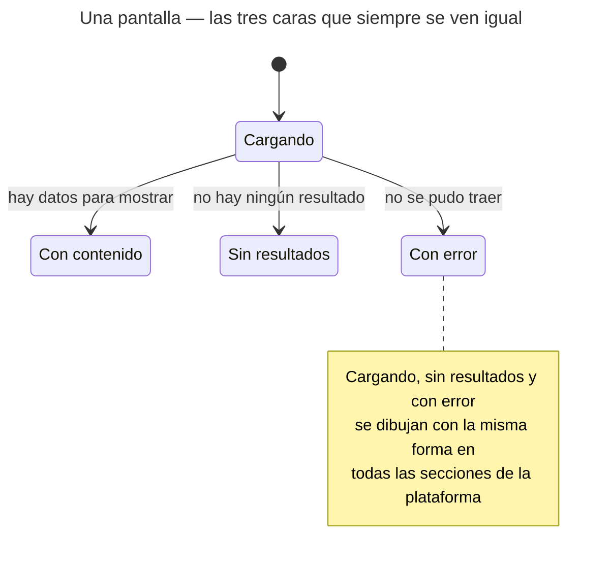
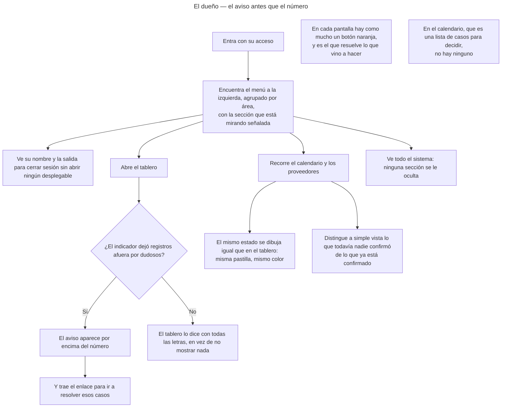
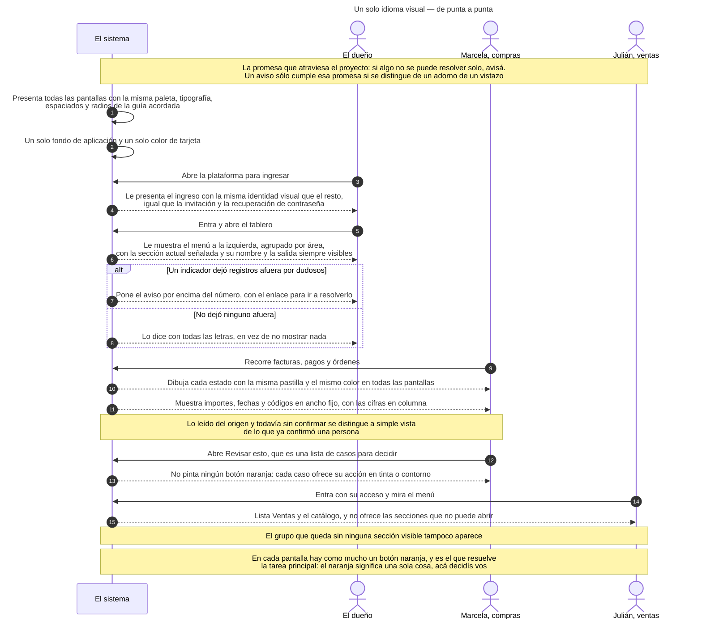
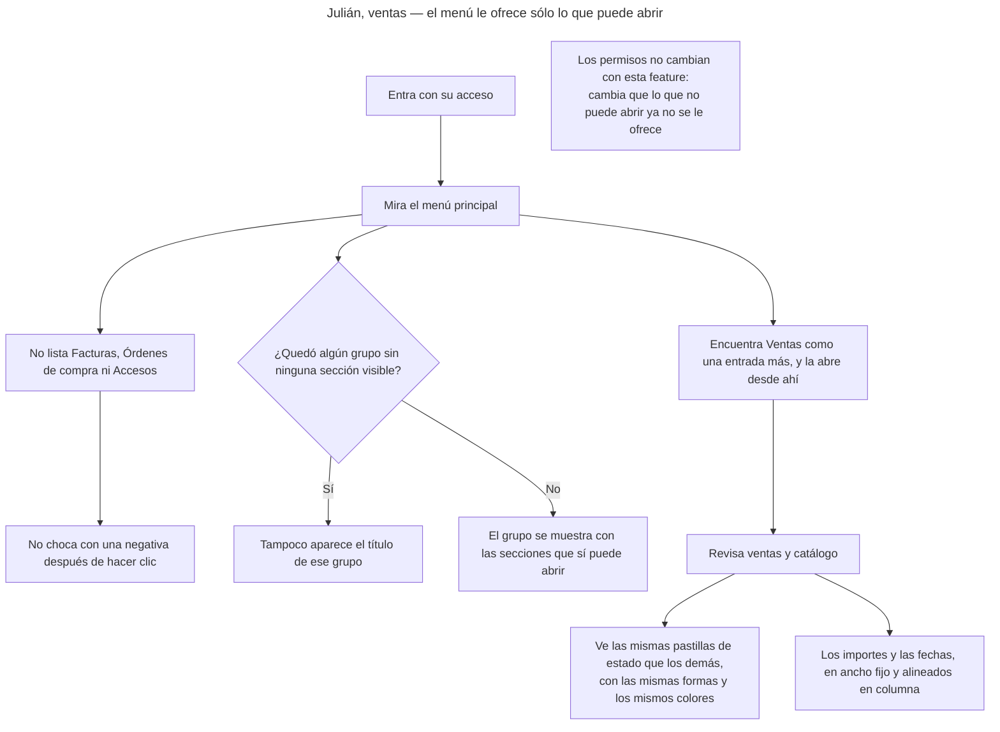
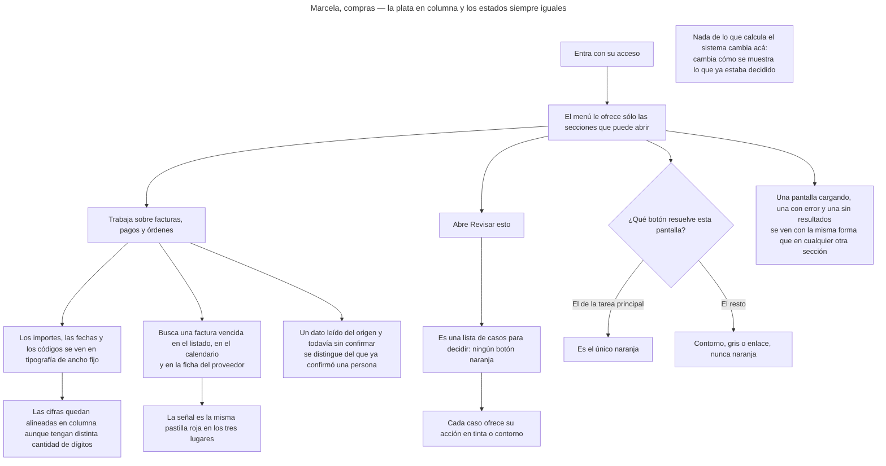
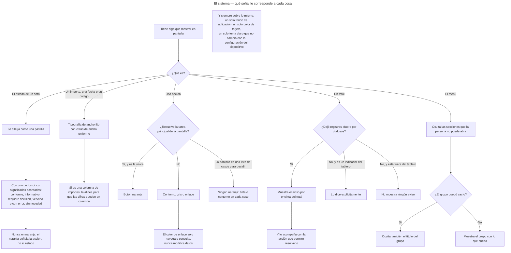

<!-- GENERADO por scripts/diagrams/export.sh — NO editar a mano.
     Fuente: los .mmd de esta carpeta. Regenerar: scripts/diagrams/export.sh -->

# Diagramas

> Vista renderizada de los diagramas de esta feature. Fuente: los `.mmd` de esta
> carpeta. Convención: `docs/specs/DIAGRAMS.md`. Las imágenes para el cliente se
> generan en `dist/diagramas/` con `make diagrams`.

## Un dato — cómo se lo confirma y cómo se lo dibuja

## Una pantalla — las tres caras que siempre se ven igual

## El dueño — el aviso antes que el número

## Un solo idioma visual — de punta a punta

## Julián, ventas — el menú le ofrece sólo lo que puede abrir

## Marcela, compras — la plata en columna y los estados siempre iguales

## El sistema — qué señal le corresponde a cada cosa

