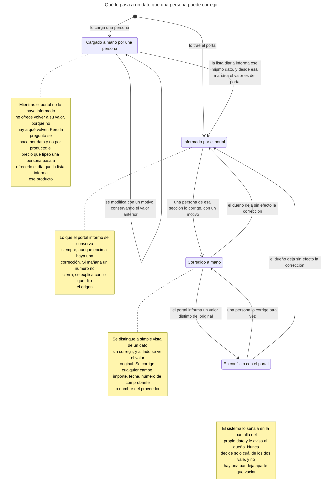
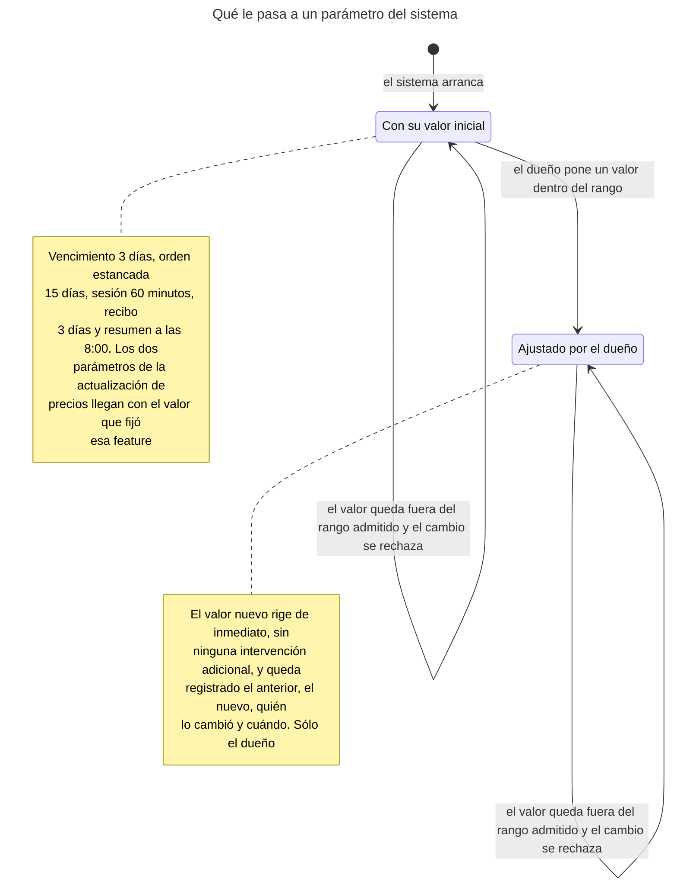
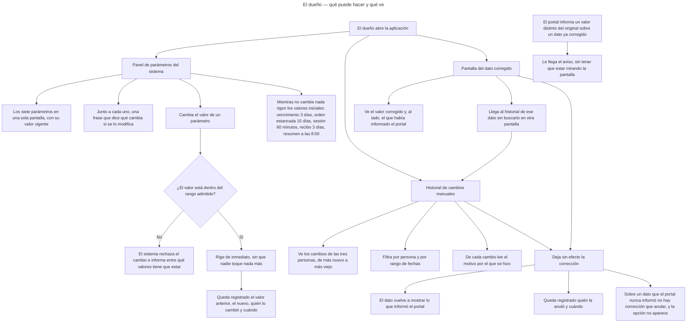
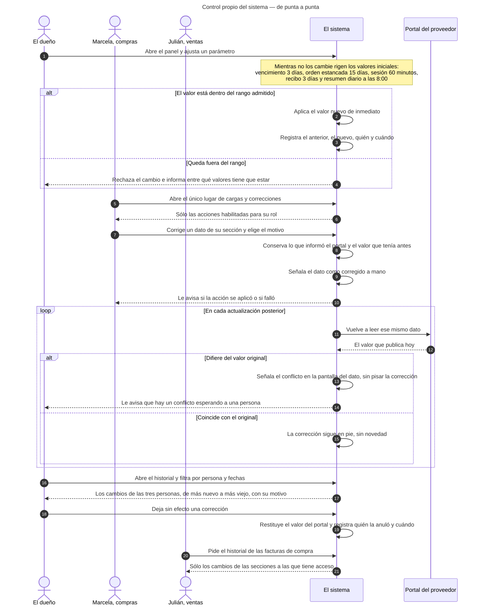
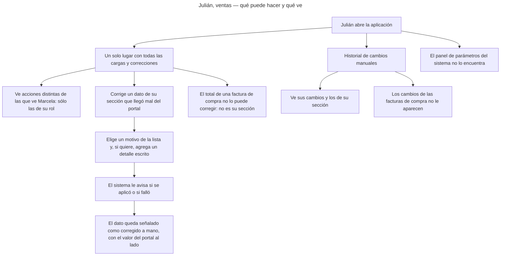
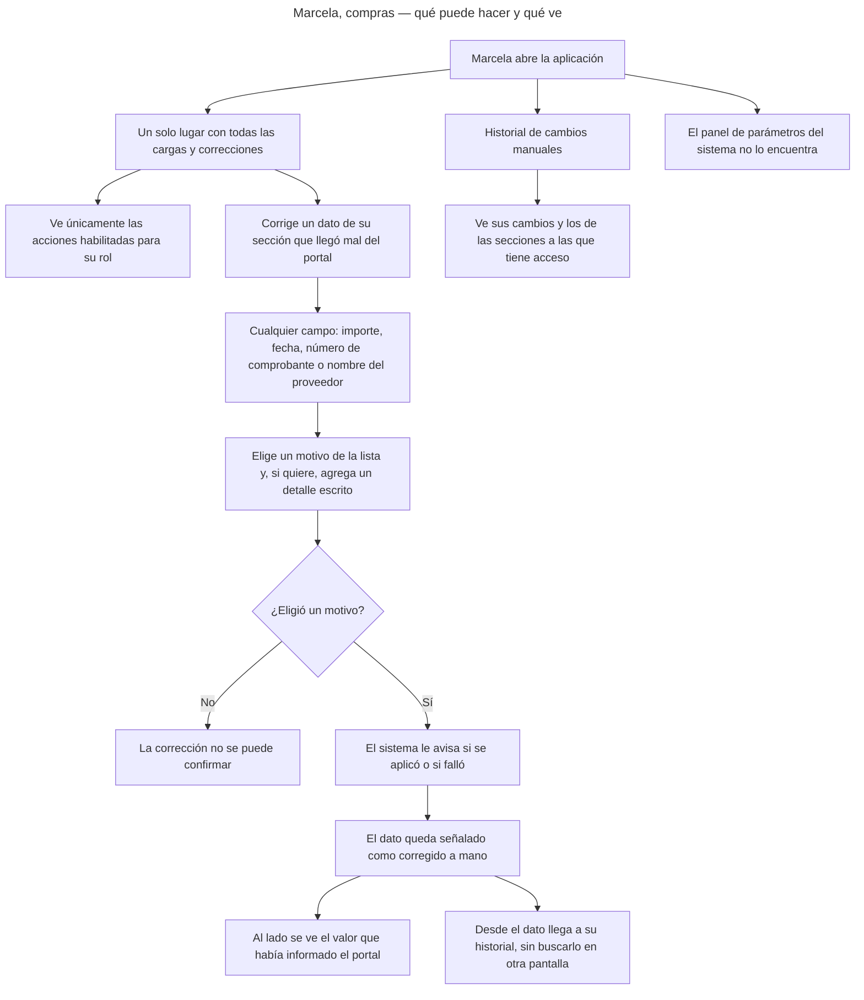
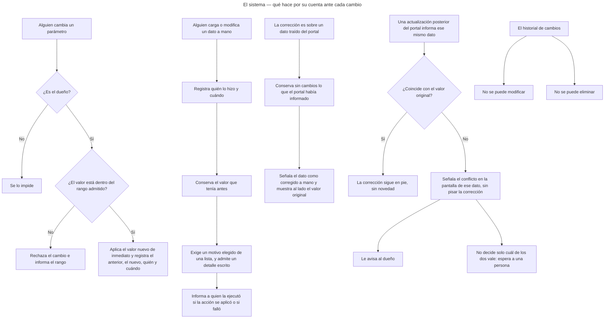

<!-- GENERADO por scripts/diagrams/export.sh — NO editar a mano.
     Fuente: los .mmd de esta carpeta. Regenerar: scripts/diagrams/export.sh -->

# Diagramas

> Vista renderizada de los diagramas de esta feature. Fuente: los `.mmd` de esta
> carpeta. Convención: `docs/specs/DIAGRAMS.md`. Las imágenes para el cliente se
> generan en `dist/diagramas/` con `make diagrams`.

## Qué le pasa a un dato que una persona puede corregir

## Qué le pasa a un parámetro del sistema

## El dueño — qué puede hacer y qué ve

## Control propio del sistema — de punta a punta

## Julián, ventas — qué puede hacer y qué ve

## Marcela, compras — qué puede hacer y qué ve

## El sistema — qué hace por su cuenta ante cada cambio

