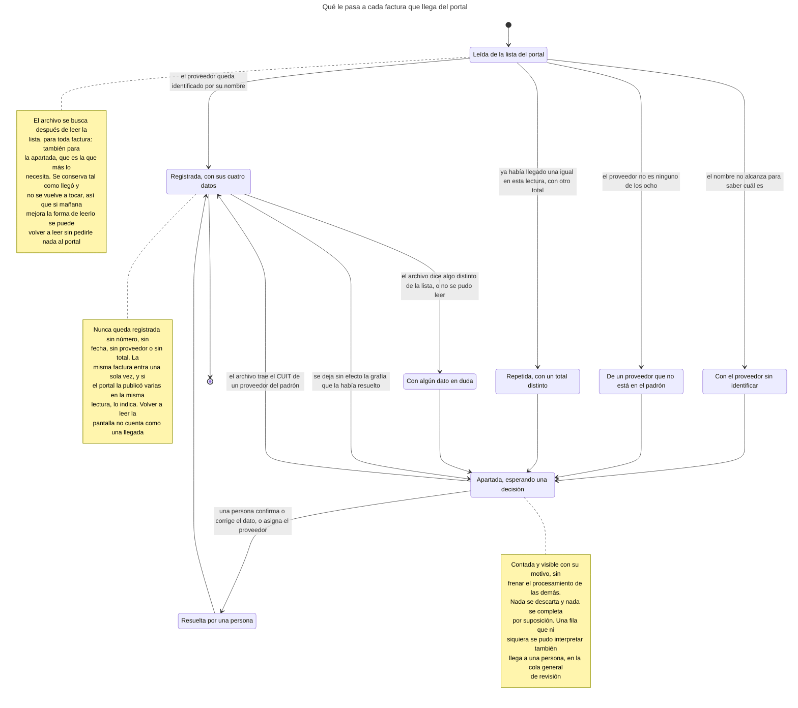
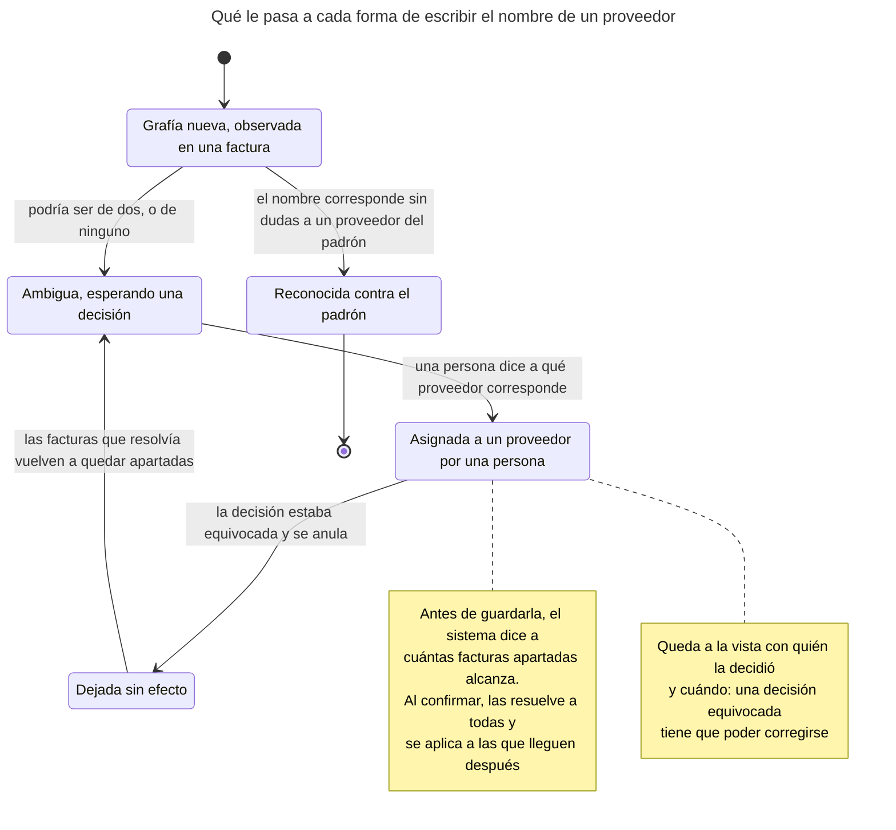
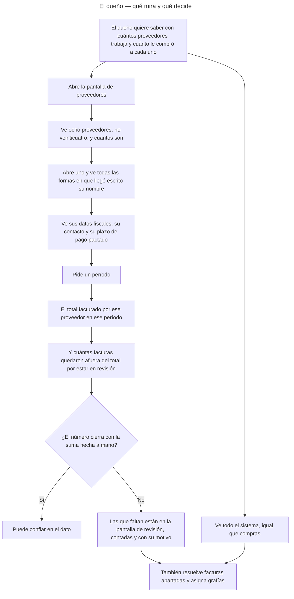
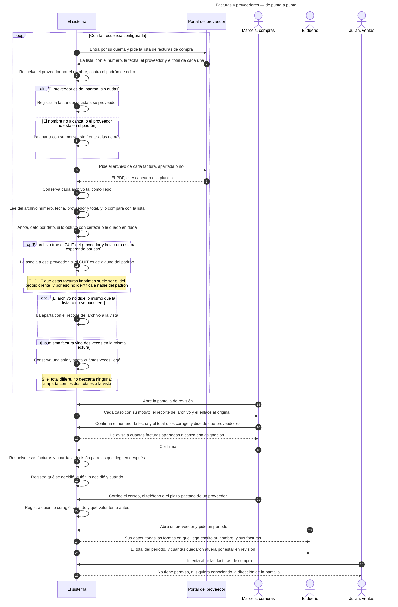
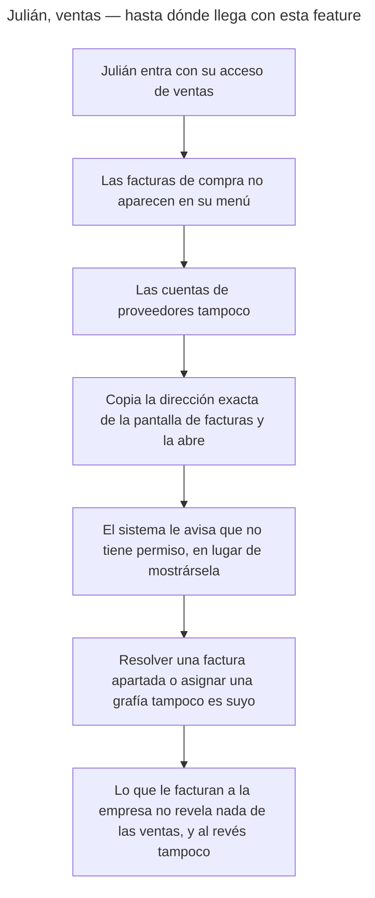
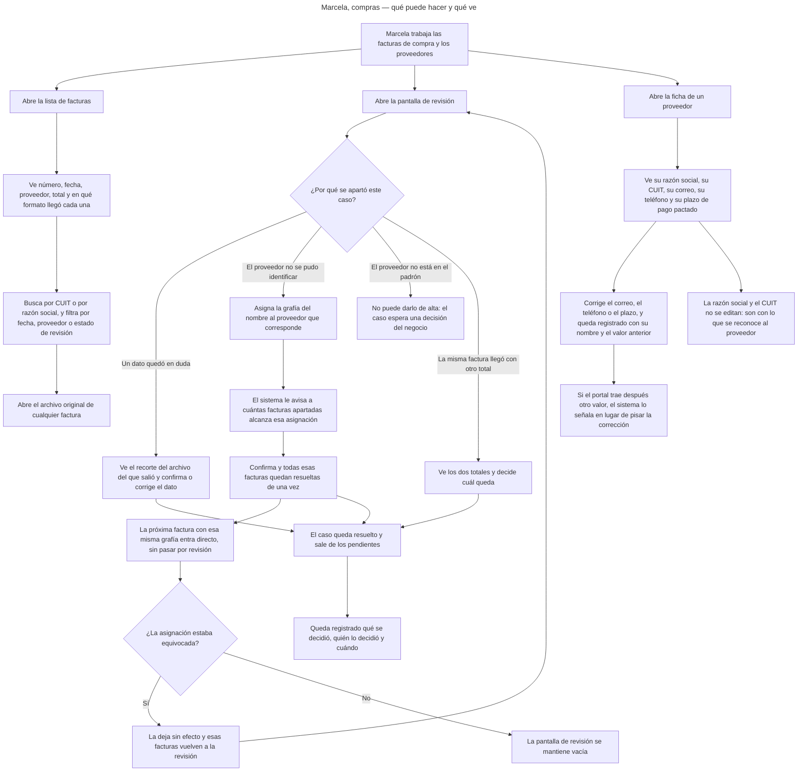
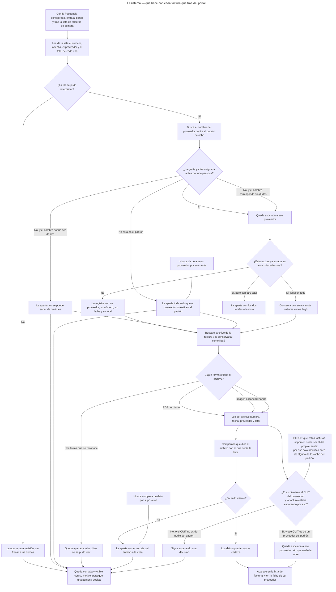

<!-- GENERADO por scripts/diagrams/export.sh — NO editar a mano.
     Fuente: los .mmd de esta carpeta. Regenerar: scripts/diagrams/export.sh -->

# Diagramas

> Vista renderizada de los diagramas de esta feature. Fuente: los `.mmd` de esta
> carpeta. Convención: `docs/specs/DIAGRAMS.md`. Las imágenes para el cliente se
> generan en `dist/diagramas/` con `make diagrams`.

## Qué le pasa a cada factura que llega del portal

## Qué le pasa a cada forma de escribir el nombre de un proveedor

## El dueño — qué mira y qué decide

## Facturas y proveedores — de punta a punta

## Julián, ventas — hasta dónde llega con esta feature

## Marcela, compras — qué puede hacer y qué ve

## El sistema — qué hace con cada factura que trae del portal

